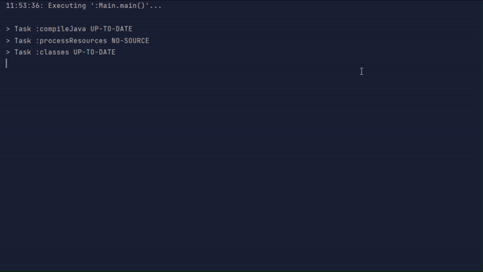

# Lord of the Rings


## Overview

This project simulates a battle between two armies from the Lord of the Rings universe: Heroes and Beasts. The objective is to simulate a turn-based combat until one of the armies emerges victorious. The simulation runs in the console and displays the progress and results of each battle.

## Table of Contents

1. [Features](#features)
2. [Project Structure](#project-structure)
3. [Classes](#classes)
4. [How to Run](#how-to-run)
5. [Future Enhancements](#future-enhancements)

## Features

- **Turn-based combat**: Heroes and Beasts take turns attacking each other.
- **Character Types**: Different characters with unique properties and abilities:
  - *Heroes*: Elf, Human, Hobbit
  - *Beasts*: Ork, Troll
- **Randomized Attacks**: Attack power is determined by rolling dice.
- **Special Abilities**: Characters have specific strengths and weaknesses against certain opponents.
- **Dynamic Battle Display**: In the console, each turn of the battle is displayed with a cooldown between actions to create a more immersive experience. This cooldown introduces a delay between each action printout, providing the sensation of following the battle in real-time.

## Project Structure

```css
src/
│
└── tokio/
    ├── Main.java
    ├── Character.java
    ├── Hero.java
    ├── Beast.java
    ├── Dice.java
    ├── Board.java
    ├── Game.java
    ├── Elf.java
    ├── Hobbit.java
    ├── Human.java
    ├── Ork.java
    └── Troll.java
```


## Classes

### Main.java
Entry point of the application. It initializes the game and starts the battle.

### Character.java
Abstract class representing a generic character in the game. Contains attributes for name, health points (HP), and resistance.

### Hero.java
Abstract subclass of `Character` representing heroes. Implements the attack method for heroes and defines an abstract method for evaluating special attack effects.

### Beast.java
Abstract subclass of `Character` representing beasts. Implements the attack method for beasts and defines an abstract method for evaluating special resistance effects.

### Dice.java
Utility class for simulating dice rolls. Heroes roll two dice and take the higher value, while Beasts roll one die.

### Board.java
Class representing the game board. Manages the lists of heroes and beasts and handles character placement and removal.

### Game.java
Class that manages the overall game logic. Initializes characters, handles the turn-based combat, and determines the winner.

### Elf.java
Subclass of `Hero`. Elves have a special attack bonus against Orks.

### Hobbit.java
Subclass of `Hero`. Hobbits have a special attack penalty against Trolls.

### Human.java
Subclass of `Hero`. Humans have no special modifiers for attack or resistance.

### Ork.java
Subclass of `Beast`. Orks reduce their opponent's resistance by 10% during an attack.

### Troll.java
Subclass of `Beast`. Trolls have no special modifiers for attack or resistance.

## How to Run

1. **Compile the project**: Navigate to the `src` directory and compile the Java files.
   
    ```bash
    javac tokio/*.java
    ```
3. **Run the project**:
   
   ```bash
   java tokio.Main
   ```
5. **Observe the battle**: The console will display each turn of the battle, showing the actions and outcomes for each character.

   

## Future Enhancements
- **Interactive Mode**: Allow users to interact with the game by making decisions for the characters.
- **Graphical User Interface (GUI)**: Create a GUI to visualize the battle with JavaFX instead of using the console.
- **Additional Characters and Abilities**: Introduce more characters and unique abilities to increase the complexity and fun of the game.
   
